  

  

 

    

 

<!-- ========================================================= -->
<!--                     CONTACT SECTION                       -->
<!-- ========================================================= -->

<h2 align="center">📬 Let's Connect</h2>

I'm always open to discussing projects, ideas, or collaborations.
Feel free to connect with me through any of the platforms below.

 

&nbsp;&nbsp;

&nbsp;&nbsp;

&nbsp;&nbsp;

 

  

<b>Thanks for visiting my profile!</b>

 

<i>Learning by building • Improving every day.</i>

